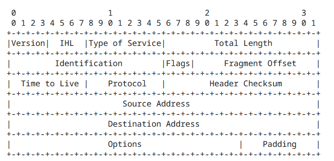
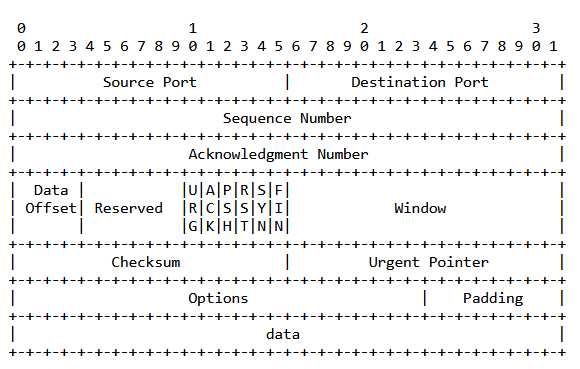

Raw sockets allow direct access to lower-level network protocols, enabling you send custom packets. This is useful for advanced networking tasks such as port scanning, where you can manipulate packet headers manually.

For example, a half-open (SYN) scan involves creating a raw socket and sending packets with only the `SYN` flag set in the TCP header. This technique helps identify open ports without completing the full TCP handshake.

Refer to the following diagrams for more clarity on how packets are structured:

IP Header

TCP Header

